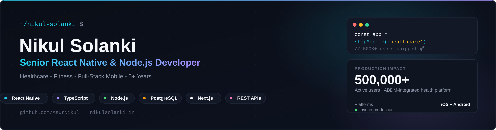

<!-- ============================ HERO BANNER ============================ -->
<div align="center">



<a href="https://github.com/AsurNikul">
  
</a>

<!-- ============================ VISITOR COUNTER + STATUS ============================ -->
<p>
  
  
</p>

<!-- ============================ SOCIAL BADGES ============================ -->
<p>
  <a href="https://nikulsolanki.in"></a>
  <a href="https://www.linkedin.com/in/solankinikul/"></a>
  <a href="mailto:nikulsolanki707@gmail.com"></a>
</p>

</div>

---

## 🧑‍💻 About Me

> **Senior React Native & Node.js Developer** building production mobile and full-stack products — including a government-integrated healthcare platform used by **500,000+ people**.

- 🚀 **5+ years** building, shipping, and maintaining React Native apps in production across **iOS and Android**
- 🏥 Engineered mobile features for **Health-e**, a digital health locker integrated with India's **Ayushman Bharat Digital Mission (ABDM/ABHA)** — 500,000+ installs
- 🏋️ Shipped **GymVice** (fitness/trainer marketplace) and **Simple Practice** (SSAT test-prep) — both live today on the App Store & Google Play
- 🏗️ Builds end-to-end: **React Native/TypeScript** clients, **Node.js/Express** REST APIs, **PostgreSQL & MongoDB** data models, **Redis** caching, **Docker/CI-CD** deployment
- 🌐 Extends into full-stack web with **React, Next.js**, and admin dashboards
- 🛠️ AI-assisted development workflow (**Cursor**) for faster iteration without cutting corners
- 🌍 Based in **Ahmedabad, India** 🇮🇳 · Gujarati / Hindi / English

```typescript
const nikul: SeniorMobileDeveloper = {
  role: "Senior React Native & Node.js Developer",
  experience: "5+ years",
  domains: ["Healthcare", "Fitness", "Education", "Full-Stack Web"],
  architecture: ["Cross-Platform Mobile", "REST APIs", "Offline-First", "CI/CD"],
  currentFocus: "Full-stack product engineering across mobile and web",
  shipped: "500,000+ users on a government-integrated health platform",
};
```

---

## 🛠️ Tech Stack

<div align="center">

**📱 Mobile**

    

**🔄 State & Data**

   

**🌐 Web & Backend**

   

**🗄️ Databases & Cloud**

    

**⚙️ Tools**

     

</div>

---

### 🏢 Where I've Shipped

| Domain | What I Built |
|---|---|
| 🏥 **Healthcare** | Government-integrated health records app (ABDM/ABHA), 500,000+ users |
| 🏋️ **Fitness** | Trainer/client marketplace with real-time booking & chat |
| 📚 **Education** | Mobile test-prep app with timed exams and progress tracking |
| 🌾 **AgriTech** | Full-stack crop & farm tracking platform (PostgreSQL/Express/React/Node) — farmer + admin apps |
| 💼 **Full-Stack Web** | React/Next.js admin dashboards and client portals |

*Most professional work is closed-source under client/employer ownership. More detail on my [portfolio](https://nikulsolanki.in).*

---

## 📫 Contact

<div align="center">

| | |
|---|---|
| 🌐 **Portfolio** | [nikulsolanki.in](https://nikulsolanki.in) |
| 💼 **LinkedIn** | [Nikul Solanki](https://www.linkedin.com/in/solankinikul/) |
| ✉️ **Email** | [nikulsolanki707@gmail.com](mailto:nikulsolanki707@gmail.com) |
| 🐙 **GitHub** | [@AsurNikul](https://github.com/AsurNikul) |
| 💬 **Stack Overflow** | [solanki-nikul](https://stackoverflow.com/users/20278666/solanki-nikul) |

</div>

---

<div align="center">

**⭐ If something here helped you, a star goes a long way!**

*Built in India 🇮🇳 · React Native & Node.js Developer · Healthcare, Fitness & Full-Stack Mobile*

<sub>Keywords: React Native Developer · Senior Mobile Engineer · Node.js · TypeScript · JavaScript · Android · iOS · Redux · Next.js · PostgreSQL · MongoDB · REST APIs · Mobile Architecture · Performance Optimization · CI/CD · Remote · Healthcare · EdTech</sub>

</div>
